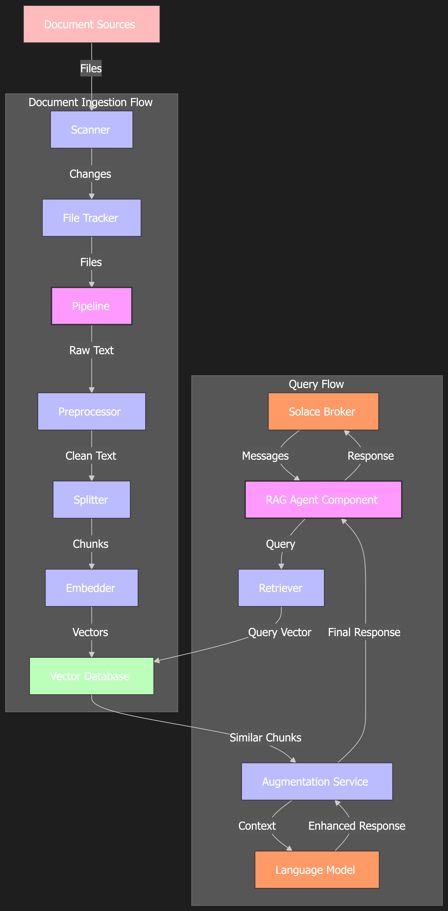

# Solace Agent Mesh RAG Architecture

This document provides a detailed overview of the Solace Agent Mesh RAG (Retrieval-Augmented Generation) system architecture and how its components interact.

## System Overview

The Solace Agent Mesh RAG is a document-ingesting agent that monitors specified directories, processes documents, and stores them in a vector database for retrieval. It provides a complete RAG pipeline that includes:

1. **Document Scanning**: Monitors directories for new, modified, or deleted documents
2. **Document Preprocessing**: Cleans and normalizes text from various document formats
3. **Text Splitting**: Breaks documents into smaller chunks for embedding
4. **Embedding Generation**: Converts text chunks into vector embeddings
5. **Vector Storage**: Stores embeddings in a vector database for efficient retrieval
6. **Retrieval**: Finds relevant document chunks based on query similarity
7. **Augmentation**: Enhances retrieved content using LLMs

## Architecture Diagram

## Component Interactions

### Document Ingestion Flow

1. **Scanner** monitors directories for document changes
2. **File Tracker** detects new, modified, or deleted files
3. **Pipeline** orchestrates the processing workflow:
   - **Preprocessor** extracts and cleans text from documents
   - **Splitter** breaks text into manageable chunks
   - **Embedder** converts text chunks to vector embeddings
   - **Vector Database** stores embeddings with metadata

### Query Flow

1. User submits a query through the **RAG Action**
2. **Retriever** embeds the query and searches the vector database
3. **Augmentation Service** enhances retrieved content using LLM
4. Response is returned to the user

## Key Components

### Core Components

- **RAG Agent Component**: The main entry point that initializes all services
- **Pipeline**: Orchestrates the document processing workflow
- **Actions**: Provides interfaces for RAG queries and document ingestion

### Document Processing Components

- **Scanner Services**: Monitor document sources for changes
- **Preprocessor Services**: Extract and clean text from various document formats
- **Splitter Services**: Break documents into chunks for embedding
- **Embedder Services**: Generate vector embeddings from text chunks

### Storage and Retrieval Components

- **Vector Database Services**: Store and retrieve vector embeddings
- **Retriever**: Search for relevant documents based on query similarity
- **Augmentation Service**: Enhance retrieved content using LLMs

## Configuration

The system is highly configurable through the `configs/agents/rag.yaml` file, which allows customization of:

- Document sources and scanning parameters
- Preprocessing options for different file types
- Splitting strategies and parameters
- Embedding models and parameters
- Vector database selection and configuration
- LLM selection for augmentation
- Retrieval parameters

See the [Configuration Guide](configuration.md) for detailed information.

## Extensibility

The system is designed to be extensible:

- Support for multiple document formats
- Pluggable preprocessors for different file types
- Multiple splitter strategies for different content types
- Support for various embedding models
- Support for multiple vector database backends
- Configurable LLM augmentation

## Next Steps

For detailed information about each component, refer to the component-specific documentation:

- [Scanner](components/scanner.md)
- [Preprocessor](components/preprocessor.md)
- [Splitter](components/splitter.md)
- [Embedder](components/embedder.md)
- [Vector Database](components/vector_db.md)
- [Retriever](components/retriever.md)
- [Augmentation](components/augmentation.md)
